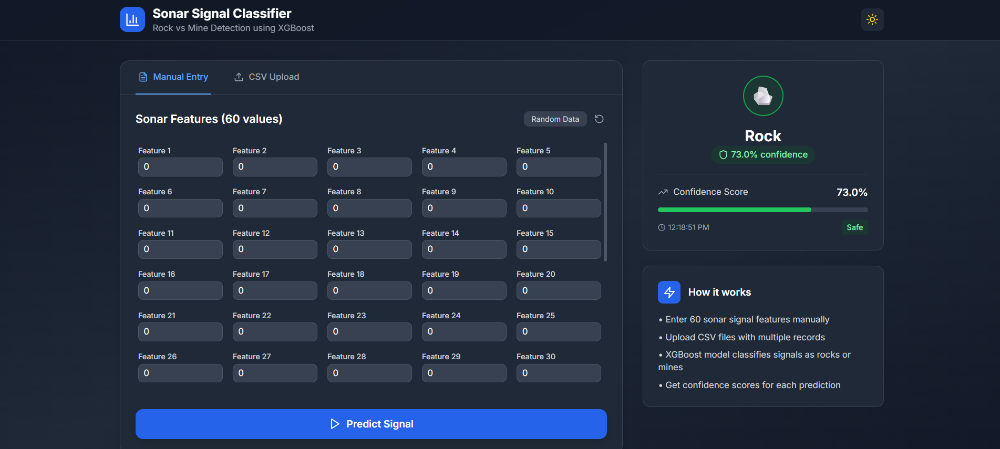
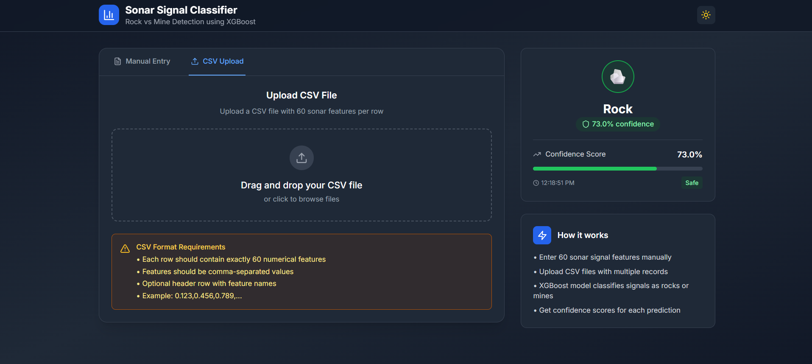
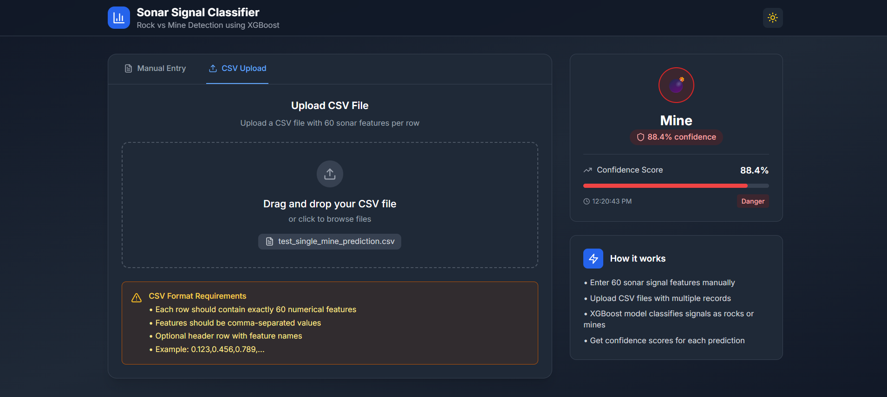
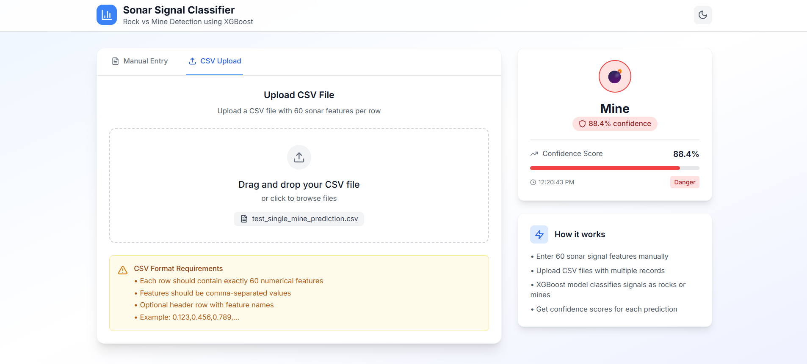

# 🧠 Mine or Rock Prediction Web App

This project is a full-stack web application that classifies **sonar signals** as either **Mines** or **Rocks** using a machine learning model. The app consists of:

- 🔙 A Flask backend with a trained ML model
- 🔜 A React + Vite + TypeScript + Tailwind CSS frontend
- 📤 CSV upload and manual input options
- 📈 Predictions displayed instantly on the UI

---

## 📌 Table of Contents

- [Overview](#overview)
- [Project Structure](#project-structure)
- [Tech Stack](#tech-stack)
- [Installation](#installation)
- [Running the App](#running-the-app)
- [Using the App](#using-the-app)
- [Testing the API](#testing-the-api)
- [Sample CSV Format](#sample-csv-format)
- [Screenshots](#screenshots)
- [License](#license)

---

## 🧾 Overview

This application predicts whether a given sonar signal corresponds to a **rock** or a **mine**, based on 60 numerical features extracted from sonar returns. It uses a trained **RandomForestClassifier** for prediction and a **StandardScaler** for preprocessing.

---

## 🗂 Project Structure

```

mine-type-prediction/
├── flask-backend/
│   ├── app.py                  # Flask app
│   ├── model.pkl               # Trained RandomForestClassifier
│   ├── scaler.pkl              # Fitted StandardScaler
│
├── react-frontend/
│   ├── src/
│   │   ├── App.tsx             # Main React component
│   │   ├── components/         # UI Components
│   │   │      ├── CSVUpload.tsx
│   │   │      ├── FeatureForm.tsx
│   │   │      ├── LoadingSpinner.tsx
│   │   │      ├── PredictionResult.tsx
│   │   │      ├── Toast.tsx         
│   │   ├── hooks/              # Custom hooks (if any)
│   │   │      ├── useDarkMode.ts
│   │   │      ├── useToast.ts              
│   │   ├── index.css           # Tailwind + custom styles
│   │   └── main.tsx
│   ├── index.html
│   └── package.json
├── test\_single\_mine\_prediction.csv
└── README.md

````

---

## ⚙️ Tech Stack

### 🧠 Machine Learning
- Python
- Scikit-learn (RandomForestClassifier, StandardScaler)
- XGboost
- Pandas, NumPy

### 🌐 Backend (API)
- Flask
- Flask-CORS
- jinja (for loading the model)

### 💻 Frontend
- React
- Vite
- TypeScript
- Tailwind CSS
- Axios (for API requests)

---

## 💻 Installation

### 1. Clone the Repository

```bash
git clone https://github.com/yourusername/mine-type-prediction.git
cd mine-type-prediction
````

### 2. Backend Setup

```bash
cd backend
python -m venv venv
venv\Scripts\activate  # Windows
# or
source venv/bin/activate  # macOS/Linux

pip install -r requirements.txt
python app.py
```

### 3. Frontend Setup

```bash
cd ../react-frontend
npm install
npm run dev
```

---

## 🚀 Running the App

* Frontend: [http://localhost:5173](http://localhost:5173)
* Backend API: [http://localhost:5000/predict](http://localhost:5000/predict)

---

## 🧪 Using the App

### 🔹 Option 1: Upload CSV

* Upload a `.csv` file with **60 features in one row**, no header.

### 🔹 Option 2: Manual Input

* Enter the 60 sonar values in a form manually.

### 🔹 Result

* The prediction will be displayed as either:

  * 🪨 **Rock**
  * 💣 **Mine**

---

## 🧪 Testing the API with Postman

### 1. Raw JSON

POST request to `http://localhost:5000/predict`

```json
{
  "data": [[0.0412, 0.1135, 0.0518, ..., 0.0085]]
}
```

### 2. CSV Upload

POST request to `http://localhost:5000/predict-file`
Use **form-data** to upload a `.csv` file.

---

## 📄 Sample CSV Format

**test\_single\_mine\_prediction.csv**

```csv
0.0412,0.1135,0.0518,0.0232,0.0646,0.1124,0.1787,0.2407,0.2682,...
```

> Make sure your CSV file has exactly **60 features**, all floats, and **no header**.

---

## 🖼 Screenshots

### 📌 Home Page


> manual Entry.


> CSV Upload.

### 📈 Prediction Result


> The result is rendered with styling and animation.

### light💡 and dark🌑 mode


> Using hooks
---

## ⚖️ License

This project is open-source and free to use under the MIT LICENSE.

---

## 🙌 Acknowledgements

* UCI Sonar Dataset
* Scikit-learn
* React Community
* TailwindCSS

---

## ✨ Author

**Mohammed Abu Hurer**
AI Engineering Student | Passionate about Machine Learning, Computer Vision, and Real-World Applications 🚀
Feel free to reach out or contribute!

---

### 🌟 Star this repository
If you found this helpful, give it a ⭐ on GitHub!
